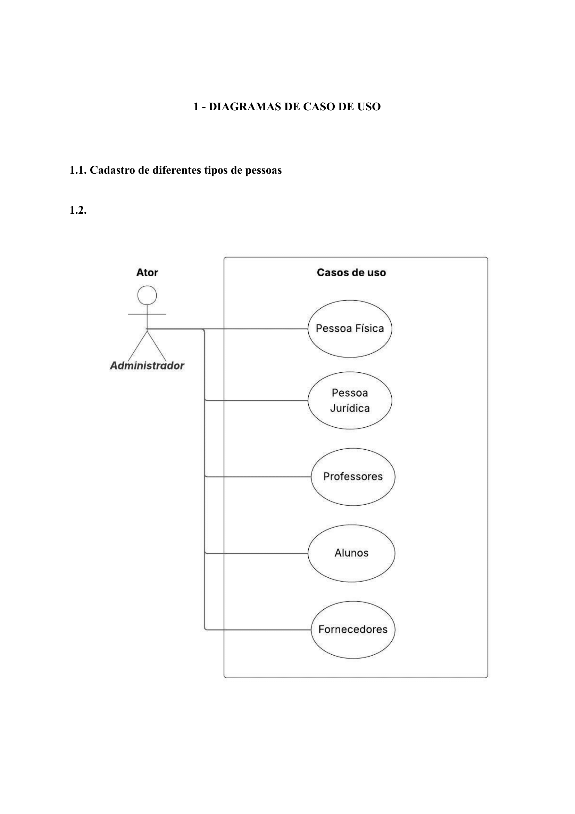

# 📋 Diagramas de caso de uso

## Sistema de Gestão Universitária

## 📊 Visão Geral do Diagrama de Casos de Uso

### **Ator Principal**
- **Administrador**: Responsável por todos os cadastros do sistema

### **Casos de Uso Identificados**

| Ator | Casos de Uso |
|------|-------------|
| **Administrador** | • Pessoa Física • Pessoa Jurídica • Professores • Alunos • Fornecedores |

## 🔄 Relacionamentos
Administrador
│
├── Cadastra Pessoa Física
├── Cadastra Pessoa Jurídica
├── Cadastra Professores
├── Cadastra Alunos
└── Cadastra Fornecedores

## 🎯 Descrição dos Casos de Uso

### **1. Cadastro de Pessoa Física**
- **Ator**: Administrador
- **Descrição**: Registrar dados básicos de pessoas físicas no sistema
- **Pré-condição**: Administrador autenticado no sistema

### **2. Cadastro de Pessoa Jurídica**
- **Ator**: Administrador
- **Descrição**: Registrar empresas e organizações
- **Pré-condição**: Administrador autenticado no sistema

### **3. Cadastro de Professores**
- **Ator**: Administrador
- **Descrição**: Vincular pessoa física ao perfil de professor
- **Pré-condição**: Pessoa física já cadastrada

### **4. Cadastro de Alunos**
- **Ator**: Administrador
- **Descrição**: Vincular pessoa física ao perfil de aluno
- **Pré-condição**: Pessoa física já cadastrada

### **5. Cadastro de Fornecedores**
- **Ator**: Administrador
- **Descrição**: Vincular pessoa jurídica ao perfil de fornecedor
- **Pré-condição**: Pessoa jurídica já cadastrada

## 🔗 Dependências entre Casos de Uso
Pessoa Física
↓
├── Professores
└── Alunos

Pessoa Jurídica
↓
└── Fornecedores

## 📋 Fluxo Geral do Sistema

1. **Administrador** faz login no sistema
2. Acessa menu de cadastros
3. Seleciona tipo de cadastro desejado
4. Executa o caso de uso específico
5. Sistema valida e persiste os dados

---

*Diagrama baseado na modelagem do sistema de gestão universitária - Projeto Integrador*

