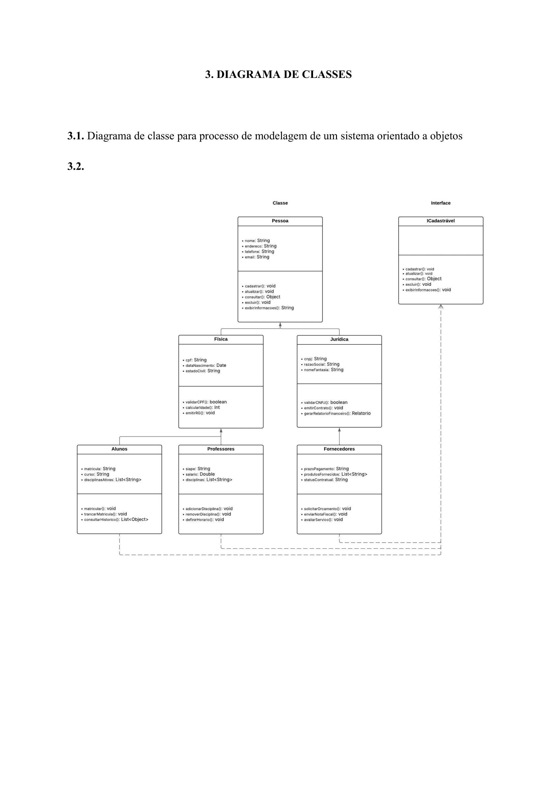

# 3. Diagrama de Classe

## Processo de modelagem de um sistema orientado a objetos

---

**Classe**

- **Pessoa**
  - nome: String
  - contextor: String
  - subdense: String
  - event: String

- **Instrutores**
  - setamento: void
  - analisando: void
  - semestrado: Object
  - excluido: void
  - extensivamente: String

---

**Física**

- **Jurídica**
  - orgs: String
  - semelocante: String
  - monolontesta: String

- **Autores**
  - matriciar: String
  - core: String
  - determinadamente: List<String>

- **Professores**
  - base: String
  - status: Double
  - adquirente: List<String>

- **Financiadores**
  - paradigmaticos: String
  - probabilistic models: List<String>
  - extensivamente: String